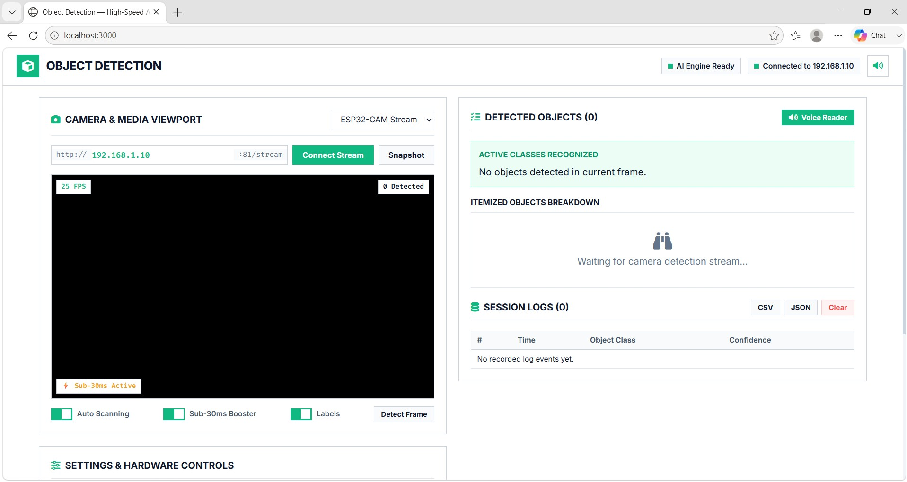
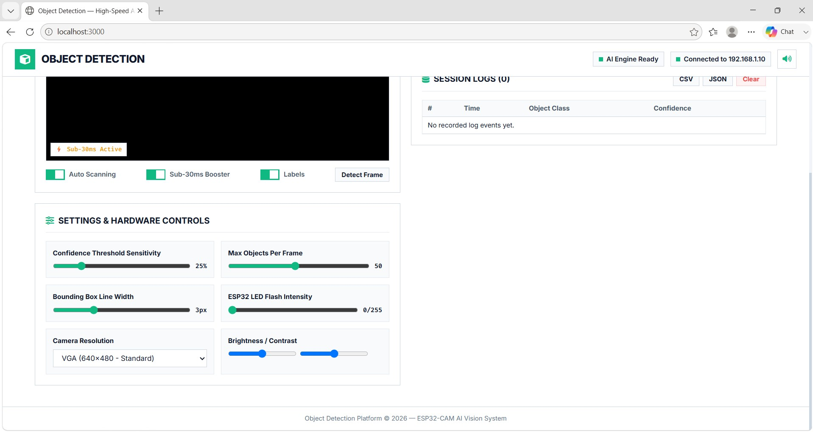

# Object Detection Platform - ESP32-CAM AI Vision System

A high-performance AI Vision System for real-time video streaming, multi-object detection using TensorFlow.js COCO-SSD, side-by-side detected item analysis, aligned hardware controls, and mobile-responsive web dashboard.

---

## Screenshots and Visual Demonstration

### Live System Working Demo


### Object Detection Dashboard and Active Class Breakdown


### ESP32 Hardware Controls and Camera Settings


---

## System Architecture and Workflow

The platform operates through a 5-step real-time pipeline from hardware video capture to browser-based neural network inference:

1. **Video Capture (IoT Layer)**: The ESP32-CAM module captures video frames using the OV2640 image sensor at resolutions up to 1600x1200.
2. **HTTP Streaming (Network Layer)**: The ESP32 serves frames over Wi-Fi as an MJPEG continuous video stream (`/stream`) or individual JPEG snapshots (`/capture`).
3. **Frame Ingestion (Web Layer)**: The browser dashboard ingests video frames and downscales them to an optimized 320x240 buffer for high-speed AI processing.
4. **Neural Network Inference (AI / ML Layer)**: TensorFlow.js executes the pre-trained COCO-SSD model directly inside the browser using WebGL GPU acceleration to detect object locations, class labels, and confidence scores in under 30ms per frame.
5. **UI Rendering and Audio Feedback (Presentation Layer)**: Bounding boxes and labels are rendered onto an HTML5 overlay canvas aligned with the video feed. Session detection logs are saved to a table, and active objects are announced aloud using the Web Speech Synthesis API.

---

## Technology Stack

### 1. IoT and Embedded Systems
- **Microcontroller**: ESP32-CAM (AI-Thinker module with dual-core LX6 microprocessor).
- **Camera Sensor**: OV2640 (Supports JPEG hardware encoding, adjustable brightness, contrast, resolution, mirror, and flip settings).
- **Communication Protocol**: HTTP REST API for frame streaming and remote camera control.
- **Hardware Programming**: C / C++ (Arduino Core / ESP-IDF framework).

### 2. Machine Learning and Artificial Intelligence
- **Object Detection Model**: COCO-SSD (Single Shot MultiBox Detector).
- **Framework**: TensorFlow.js (Runs neural networks directly in client browser environments).
- **GPU Acceleration**: WebGL (Offloads matrix math and tensor operations to client GPU hardware).
- **Audio Intelligence**: Web Speech Synthesis API for real-time text-to-speech object readouts.

### 3. Web Frontend and Tooling
- **Structure and Logic**: HTML5, Vanilla JavaScript, React 18.
- **Styling**: CSS3 with flat layout design system, responsive grid (`@media (max-width: 768px)`), and dark/light UI components.
- **Development Servers**: Vite dev server and custom Python HTTP server.

---

## COCO-SSD AI Model Overview

### What is COCO-SSD?
COCO-SSD is an object detection model designed to locate and identify multiple objects within a single image frame:
- **COCO Dataset**: Trained on the Common Objects in Context dataset, recognizing 80 everyday object classes (including people, vehicles, animals, furniture, electronics, and kitchenware).
- **SSD Architecture**: Single Shot MultiBox Detector predicts object bounding box coordinates and class probability scores in a single feed-forward pass through the network, making it suitable for real-time performance.

### Key Benefits of Client-Side WebGL Inference
- **Zero Cloud Costs**: All neural network processing runs locally inside the browser. No external API keys or cloud GPUs are required.
- **Low Latency**: Inference executes in 15ms to 30ms per frame via WebGL hardware acceleration.
- **Privacy First**: Video streams and image frames never leave your local network.

---

## How to Run

### Method 1: Custom Python Server (Recommended for Windows)
```bash
cd web
python server.py
```
Open **http://localhost:8000** in your browser.

### Method 2: Vite Development Server
```bash
cd web
npm install
npm run dev
```
Open **http://localhost:3000** in your browser.

---

## Hardware Requirements and Pin Wiring

### Components Required
1. **ESP32-CAM Module** (AI-Thinker model with OV2640 camera).
2. **FTDI USB-to-Serial Programmer** (Set jumper to 5V power supply).
3. **Female-to-Female Jumper Wires**.
4. **5V Power Supply / USB Cable** (Minimum 1A power adapter recommended).

### FTDI Programmer to ESP32-CAM Pin Connections

| FTDI Adapter Pin | ESP32-CAM Pin | Usage Notes |
| :--- | :--- | :--- |
| **VCC (5V)** | **5V** | ESP32-CAM requires stable 5V input |
| **GND** | **GND** | Common ground connection |
| **TX** | **U0R (GPIO 3)** | Serial Receive (RX) |
| **RX** | **U0T (GPIO 1)** | Serial Transmit (TX) |
| **GND** | **GPIO 0** | Connect ONLY during firmware flashing |

> **Note**: Disconnect GPIO 0 from GND after uploading firmware, then press the RESET (RST) button to reboot the ESP32 into normal execution mode.

---

## ESP32 HTTP API Reference

| Method | Endpoint | Description | Example Request |
| :--- | :--- | :--- | :--- |
| `GET` | `http://<IP>:81/stream` | Continuous MJPEG Video Stream | `http://192.168.1.10:81/stream` |
| `GET` | `http://<IP>/capture` | Single JPEG Frame Snapshot | `http://192.168.1.10/capture` |
| `GET` | `http://<IP>/control` | Adjust camera hardware parameter | `http://192.168.1.10/control?var=led_intensity&val=200` |

---

## License
This project is open-source and available under the MIT License.
